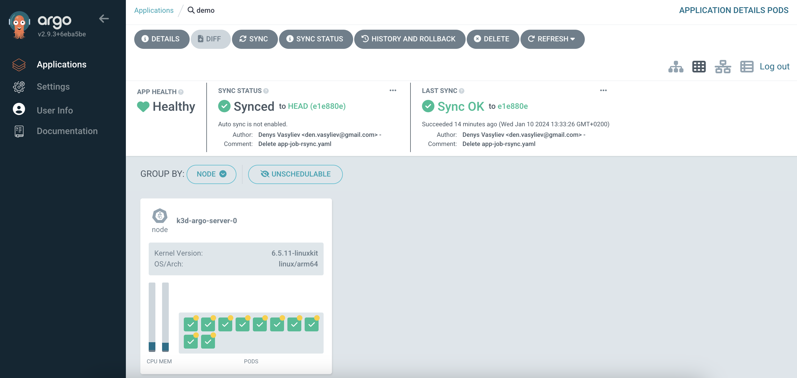

# MVP

### 1. Creating ArgoCD app
- Open ArgoCD and click on "NEW APP";


- Enter app name;
- Set "Auto-Create Namepsace" so system will create the new namespace;


- Enter repository URL;
- In the fiels "Path" set path to the helm folder;


- Enter Cluster URL;
- Enter namespace name;


- After configuration click "CREATE"


### 2. App sync
To synchronize application - click on the "SYNC" button. If there are any differents between current and desired states, ArgoCD will sync states.




### 3. Service testing

- Make port forwarding for service
```bash
kubectl port-forward svc/ambassador 8081:80
```


- Run curl to check service
```bash
curl localhost: 8081
```


- Run curl and pass some image into it to use it as a payload

```bash
curl -F 'image=@GithubMark.png' localhost:8088/img/
```


