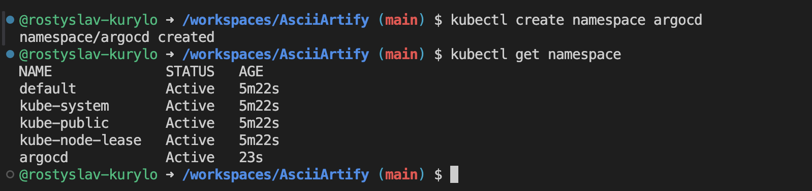
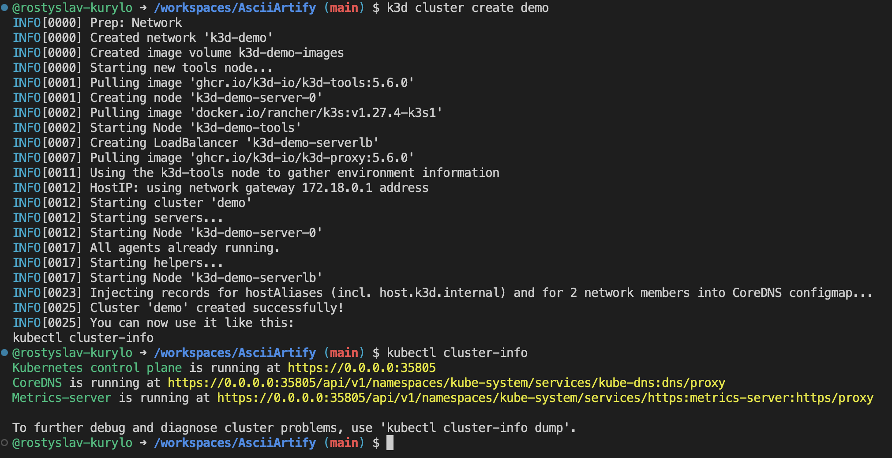

# Guide for accessing the ArgoCD interface

### 1. Install k3d

```bash
curl -s https://raw.githubusercontent.com/k3d-io/k3d/main/install.sh | bash
```

### 2. Create new cluster

#### 2.1. Create argocd namespace

```bash
kubectl create namespace argocd
kubectl get namespace
```


#### 2.2. Create cluster

```bash
k3d cluster create demo
kubectl cluster-info
```


### 3. Install ArgoCD

#### 3.1. Create ArgoCD namespace

```bash
kubectl create namespace argocd
```

#### 3.2. Install ArgoCD via manifest

```bash
kubectl apply -n argocd -f https://raw.githubusercontent.com/argoproj/argo-cd/stable/manifests/install.yaml
```

#### 3.2. Check installation

```bash
kubectl get all -n argocd
kubectl get pod -n argocd -w
```

### 4. Getting access to the ArgoCD GUI

#### 4.1. Make port forwarding

```bash
kubectl port-forward svc/argocd-server -n argocd 8080:443
```
Now GUI can be found on 127.0.0.1:8080<br />
Use **admin** as a default username. For getting autogenerated password, use nex command

```bash
kubectl get secret argocd-initial-admin-secret -n argocd -o jsonpath="{.data.password}" | base64 -d; echo
```
